## Travel Notes

**第一次90%以上由自己规划行程的出境旅行，感觉还是有写一篇游记的必要的。**

*一些注意事项*：

- **交通卡储值**一定要买，ICOCA或SUICA在全日本乘坐JR、电车、地铁、巴士都非常方便，机场的HARUKA可以凭ICOCA购买折扣票。京都或大阪地铁电车的One-day Pass视情况购买，乘坐4次以上回本。（**抱歉，有了One-day Pass真的可以为所欲为**）
- 关于**日元现金**，保守建议按10k日元/day准备。**可以使用Visa、img/IMG_Alipay、Wechat、UnionPay的地方**有：大型商场、连锁便利店、网红品牌专卖店以及各种中国游客非常多的区域。**只能使用Cash的地方有**：电器街/步行街的小店铺饭店、游客较少的区域、各种自动售货机。整个行程下来体感还是使用现金更方便一些。日元不需要在国内换，关西大阪机场有支持银联的ATM，一般每次仅收取10元左右的手续费。另外**在711便利店的ATM可以免手续费取日元现金**。但要注意有些外币兑换机器或人工服务汇率是按15.3兑换的，非常亏，兑换的时候一定要看清楚。
- 关于**语言和交流**，游客非常多的地方比如机场、较大的站台、药妆店等等甚至是有中文服务的。在大城市，日常的交流用比较简单的英语是没问题的，不需要英语非常好，因为日本人英语也并不是很好（听懂日本人的英语是真的有点费劲）。当然如果会日语，很多时候是非常方便的。
- ...

**先放一下旅行的总花费**（不包括带回国消费的购物商品）

|项目|费用|备注&明细|
|:---|:---|:---|
|签证|**RMB1400元**|三年多次往返|
|往返机票|**RMB4770元**|合肥新桥-上海浦东-大阪关西，含保险|
|轨道交通|10800Yen/**RMB648元**|机场-京都HARUKA **1600日元**,  ICOCA **8000日元** (开卡2000&充值6000)， 大阪**one-day pass**两日 **1200日元**|
|住宿|**RMB2452元**|青旅两晚**600元** (每日240元+60元清洁费)， 大阪两晚**300元**， 有马温泉食宿一晚**1418元**， 大阪今里一晚**134元**|
|Airbnb体验|**RMB450元**|**Travel sketchbooking in Kyoto**|
|门票|4300Yen/**RMB258元**|蓝天大厦**2000日元**，大阪海游馆**2300日元**|
|饮食|28230Yen/**RMB1694元**|Apr4回转寿司晚饭**1500日元**， Apr5锦市场午饭**1680日元**， Apr6晚饭道顿掘文字烧**1380日元**， Apr7&8便利店早饭两日共**800日元**， Apr7午饭一蘭拉面**1490日元**， Apr7黑门市场晚饭**1100日元**， Apr8中之岛午饭**1400日元**， Apr8有马升级神户牛肉&梅酒**3900日元**， Apr9奈良午饭套餐**1980日元**， Apr9寿司店晚饭**3000日元**|
|**总计**|**RMB11673元**|其中，现金**共取出5万日元**，**剩余8000日元**。|
（带回国消费的商品其实就是Switch啦，另外还有一些比较便宜的纪念品等等）

#### *Apr 4* - Day 1 京都Kyoto

- **航班12:10抵达大阪关西国际机场**

- **关西机场特快HARUKA-关西国际机场到京都站, 耗时1小时20分钟, ICOCA优惠券1600 Yen**

-----

日本的**Bic Camera**电器城遍布各大城市的JR站附近。由于试玩了同学的机子之后对Nintendo Switch太过渴望，到达京都站之后直奔**Bic Camera**买了一台Switch，因为8%的免税和银联的满减，一台Switch加上塞尔达传说，再加上一张钢化膜的价格和在国内买一台裸机的价格是差不多的，而后面事实证明买Switch简直是血赚啊。

来到店里发现Bic Camera不仅支持微信支付宝银联，居然还**支持BitCoin支付**，惊了。后来得知日本政府对炒比特币、炒外汇，是持非常开放，甚至是鼓励的的态度的。

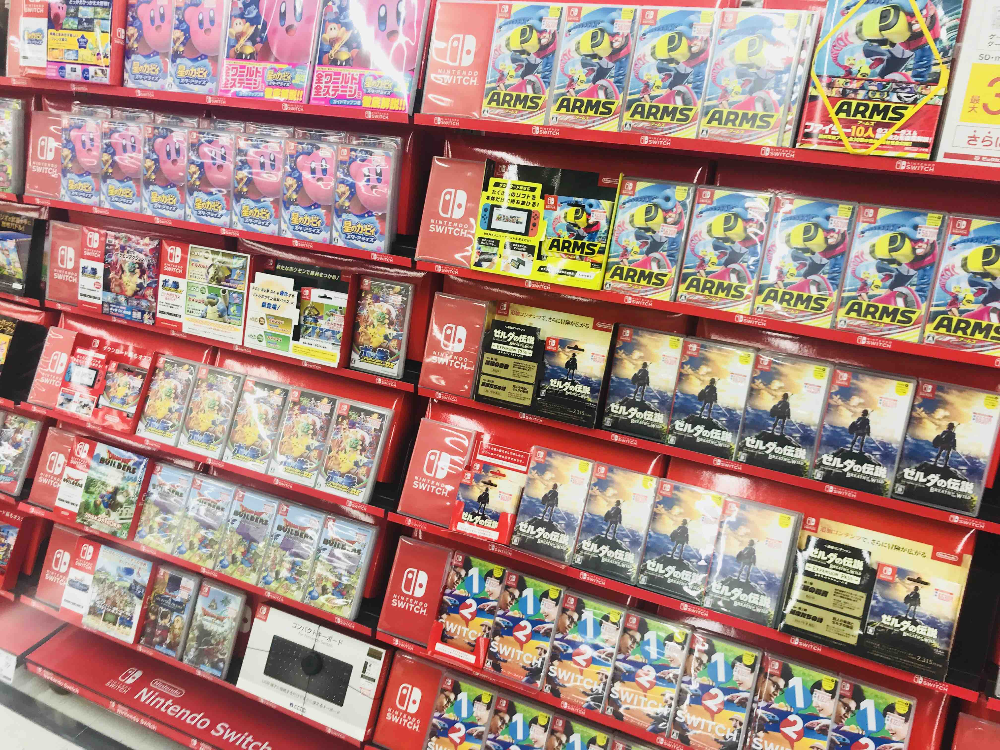
*BicCamera 7层游戏影视专售（给NS留出了好几个展柜）*

晚上到达住处时已经将近7点。原计划中的锦市场、八坂神社和衹园只能放在后面几天。

住处是从Airbnb上订的青旅**Onigiri Guest House**，位置在十条站附近的小巷中，这里离任天堂的总部只有两个路口的距离，然而任天堂的大楼实在是太低调，也不开放参观，如果不是看到门口的logo真的无法相信。这一片区域游客比较少，街道上也非常清净，由于临近稻荷神的祭典，每户门口都贴了「**稻荷大神御献酒**」的字样。

青旅的床位空间不大，但只属于自己一个人，暖色调的台灯，极简却整洁的配置，让从早晨开始奔波了一路的我有点热泪盈眶的感觉。日本的房子不大，室内面积也都比较小，大家都喜欢待在自己的床位。住进来的人之间交流其实并不是很多，仅限于见面打一声招呼，早上互道早安。入住的男女人数相同，除了我以外并没有见到中国人。

在青旅第一个遇到的是一个戴口罩的短发JK妹子。在厨房相遇的时候，我准备好和她打个招呼，然而并没有eye contact。这让我产生了对日本人的最初印象。由于日本有1/3的人口患有花粉过敏，人们在樱花季为了避免过敏戴上口罩的同时，也有一种陌生人之间的距离被拉远了的感觉。在工作以外的场合，人们避免麻烦的社交，**时刻小心不要给别人添麻烦，也不愿别人麻烦自己**。不过很快，我对日本人又有了另一个印象，每个人都好有礼貌，和他们打交道会给你一种很舒服的感觉。不仅仅是服务业，平时在路上也时常听到「すみません（对不起）」（后来想想这其实也是不给别人添麻烦的一种体现啊）。

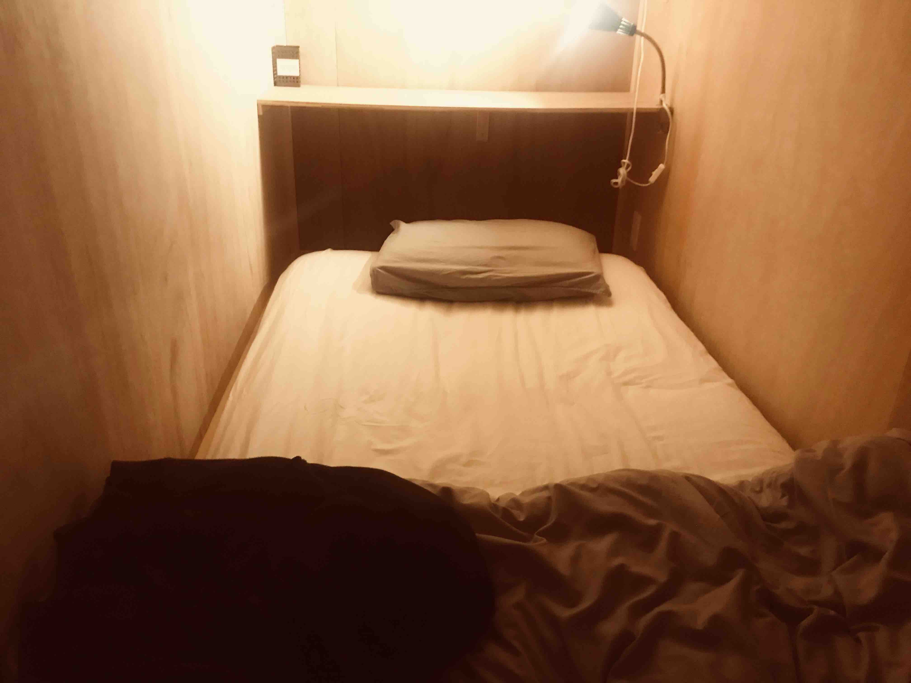
*住处的床位，有点胶囊旅店的感觉*
 
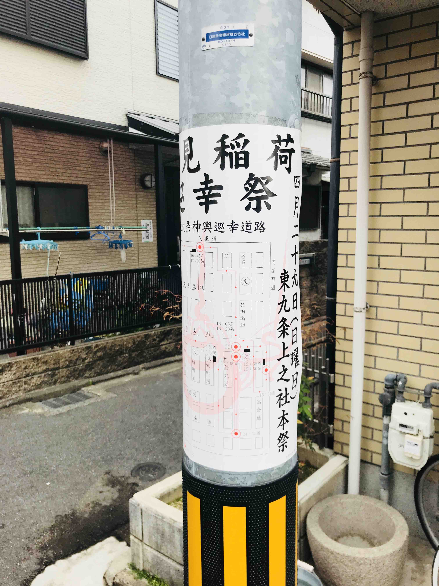
*京都的街道*
 
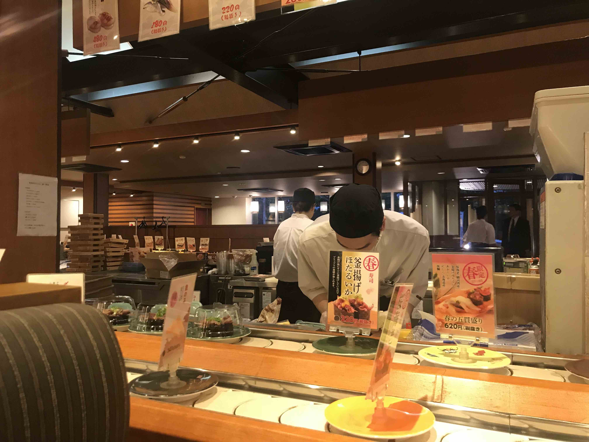
*到日本第一顿 超大的一家寿司店*

因为时间已经比较晚，我们顺着街道找到一家不是太远的回转寿司，这家店店面很大，但价格还蛮亲民的，人均只花了1500日元。吃过晚饭回来已经很累了，于是第一天的夜晚就在探索塞尔达的世界中度过了。

当然塞尔达也不是白玩的，在任天堂总部所在的京都玩塞尔达是有着特殊意义的（**这就是你死肥宅的借口？**）。据说《塞尔达传说：荒野之息》中的世界地图是可以与京都的地图找到关联的:

> 任天堂是一家京都的公司，而藤林秀麿是土生土长的京都人，他们选择把京都的地理状况适配到游戏中。

> 当把京都的地理状况适配到游戏中时，就能简单地体会东南西北的距离感了，也可以想象横穿地图会有多累，会花多少时间。或者是骑马，能多块跑完一段路程。

> 正如大家到京都旅行所感受到的，在京都，有各种各样的寺院、神社、观光点。以这些实际的地点为依据，在游戏制作过程中对距离感的把握变得具体，工作人员之间的沟通也变得轻松。

> 玩家打开地图所看到的密密集集的祠、街道，游戏制作人员通过以京都为参考模板，将距离和节奏设计得更合乎玩家大脑的兴奋点唤起，令《荒野之息》的世界成为玩家最能享受的大小。

*将京都地图与《塞尔达传说：荒野之息》中的地图重合*

> 在这份重合的地图里，我们可以看到，回生之祠和故事开始的地方，差不多就在任天堂的公司总部所在地。藏着大师之剑的迷いの森，刚好对应1869年迁都东京前的历代天皇所居住的京都御所。中央ハイラル里藏着已被列入世界遗产的德川家康居住过的二条城。

> 参见知乎：《荒野之息》一份全新的京都观光指南
> <https://zhuanlan.zhihu.com/p/27025974>

#### *Apr 5* - Day 2 京都Kyoto

-----

这一天的早上我第一次体会到了**日本地铁电车线路是有多么复杂**，跟着Google Map走到电车站，为了确认没有做错方向，我问了旁边的大婶这一侧是不是前往中书岛方向，大婶说是。到了中间某一站的时候我还在傻坐着，大婶特地找到了我的车厢告诉我要在这一站换乘（还是要感谢一下负责的大婶）。我这时才发现，在日本即使是同一条线同一个方向，电车的车次是会**有普通、急行和特急之分的，其区别在于沿途所停靠的站不同：普通每站都停但区间更短；而特急常常可以跨城市，但中间很多站不会停**。

- **Travel sketchbooking in Kyoto**
	-  **10:00 a.m. to 1:00 p.m.** 
	-  **葭島矢倉町59番地, 京都市伏見区, 京都府 612-8228, (59 Yoshijima Yagurachō Fushimi-ku, Kyōto-shi, Kyōto-fu 612-8224)** 

在Airbnb上报名参加的一个体验。一行五个人，居住在日本的美国画家Rachel，一对美国夫妇，一个已经来过日本很多次、日语和英语都非常厉害的中国小姐姐。比较巧的是，夫妇都是CS Phd毕业，现在在加州工作，一个做计算机视觉，一个做IoT，发现是同行之后顿时来了话题，不然怕是真的全程尬聊。

3个小时的旅行包含了中书岛以及伏见稻荷大社。Rachel为我们提供了绘本和水彩颜料，在巷子和神社中漫游的同时，向我们介绍了区域的历史、文化；选取了3个取景点向我们介绍如何用水彩来表现色彩、纹理和光影。**对于很少接触水彩、并且习惯用相机记录景色的我来说，真的是一次不一样的体验**。

在渣绘过程中，很多路人游人靠近过来围观称赞，各种膨胀。尤其是在伏见稻荷大社画千本鸟居时，画的真的很烂（画之前没有把这个视角的透视做好，所以有点画崩了），居然还有人问能不能给我拍张照，真的是很有满足感hhhh。Rachel: 这就是为什么画家都那么热衷于办自己的画作展。

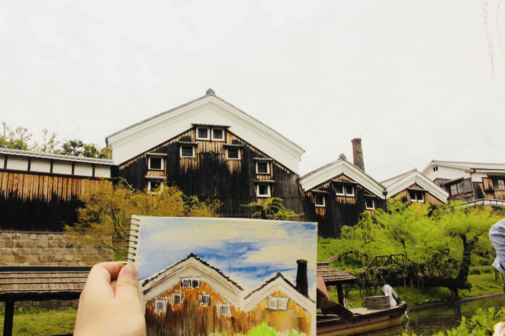
*伏见运河*
 
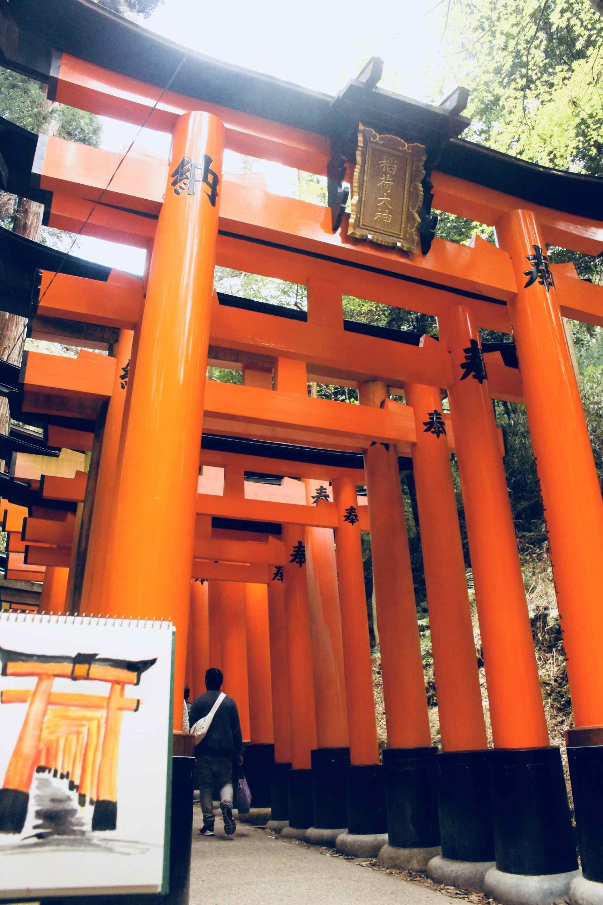
*伏见稻荷大社 千本鸟居*

- 中书岛 Chūshojima
	
	> - 以酒造聞名的伏見是京都有名的名勝，有名的伏見運河貫穿其中，伏見運河名為「宇治川派流」，是聯絡宇治川和豪川間的人工運河，開鑿運河始自文禄三年（一五九四）豊臣秀吉建築伏見城時、為了輸送建城所需要的材料建立了伏見港和「宇治川派流」。後來在兩岸建立了許多米藏和酒藏，是江戶時代非常重要的水運交通設施。 

伏见区是一个以酿酒闻名的地区，而中书岛区域更是保留了十分集中的酿酒藏酒相关的历史建筑。这个时间樱花已经落得差不多了，但伏见运河上还是铺满了樱花的花瓣，可以说是相当梦幻了。

在伏见区随处可见保留至今的酿酒场和酒屋，其屋檐上挂着松球，**当松球颜色变深，即意味着新酒已酿成，欢迎客人到店内品尝**；不过这松球也是价值不菲。小巷中有一口引神明之水的水井，共居民以及酿酒人免费取用。

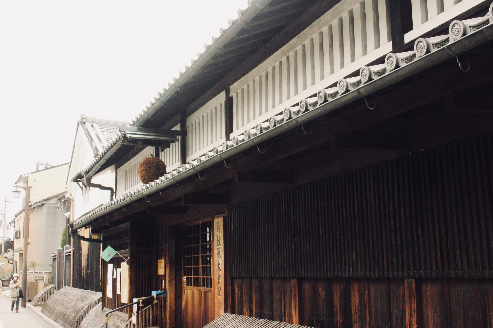
*挂着松球的酿酒纪念馆*

- 伏见稻荷大社 Fushimi Inari-taisha Shrine <http://inari.jp/>

	> - 主要供奉以宇伽之御魂大神为首的诸位稻荷神，是深受京都人爱戴的神社之一，香火最为旺盛。稻荷神就是狐狸神，被认为保佑五谷丰收，衍生为商业繁荣。伏见稻荷大社内，到处可见口中叼着稻穗或谷物的狐狸，接受人们的膜拜与礼敬。

相比游客稀少的中书岛，伏见稻荷大社的游客量从刚到达电车站就能感受到。沿着千本鸟居爬上稻荷山再下山，全程大约2个小时。

伏见稻荷大社的**千本鸟居**算是京都的一个招牌了，每一个鸟居都来自于会社或个人的捐赠。正面刻有纳奉二字，而背面记录了捐赠者以及捐赠时间。鸟居有大有小，大到可以从中穿过，小到可以摆在供台之上，不同的大小又有着不一的价格。
	
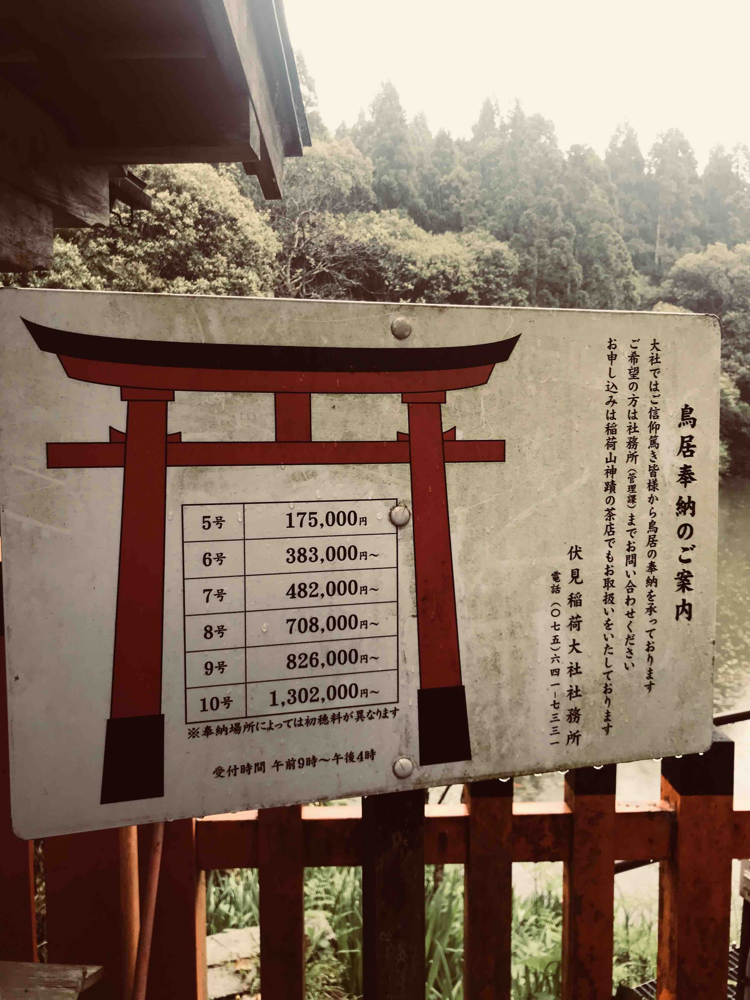
*不同鸟居的捐赠标准*

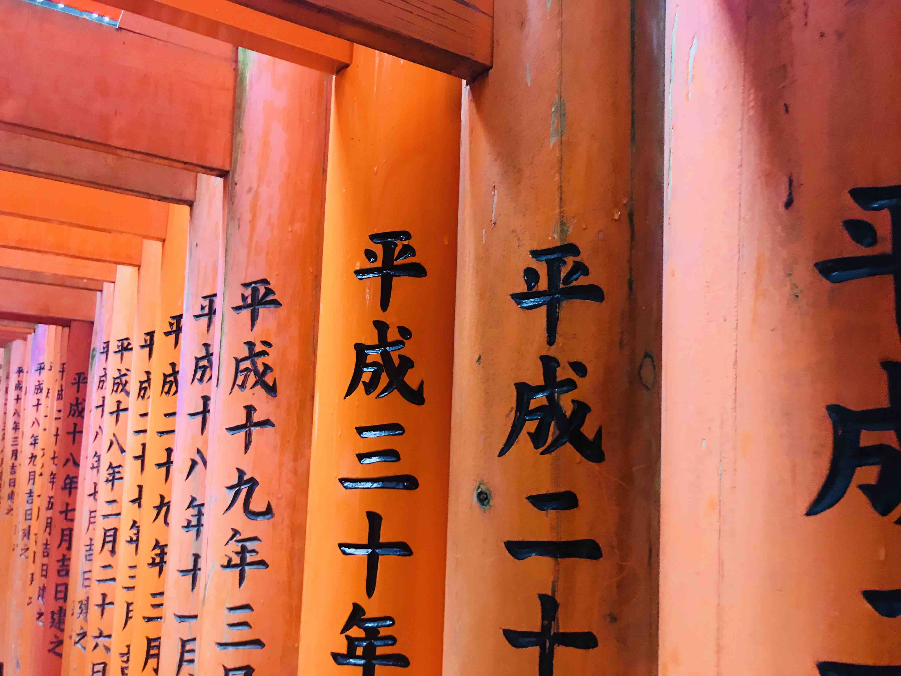
*不同时间捐赠的鸟居*

-----

- 锦市场 Nishiki Market <http://www.kyoto-nishiki.or.jp/> 
	
	> - 锦市场约有140多家店铺，贩卖生鲜食品、各式蔬菜、干货、腌菜和极具京都特色的调料。
	> - 虽然有不少鱼摊小贩，但整体环境非常的干净整洁，喜欢逛吃的人在这里至少得花上两个小时去体验。
	> - 大部分店家的营业时间为12-17点，虽然商品不是最便宜的，但这里却是最亲近京都人生活的地方

京都的锦市场已经有百年的历史了，被称为京都人的厨房。上午中书岛和伏见稻荷大社的行程结束已经到了下午2点，乘地下铁到衹园四条，到锦市场开始逛吃逛吃。对于我这种日料的狂热爱好者，到了日本会有一种，在街边随便找一家小店都是日料店、而且食物都很棒的惊喜和满足感，到了下午三点，找到一家专门做天妇罗的一家小店，**点上一碗（幸福的）天妇罗乌冬面、一份鳗鱼天妇罗、一杯生啤**，算作小歇。

在锦市场见到了我在某日料店喝了一次开始心心念念的Lupicia专卖店，除了它家的招牌**白桃乌龙**以外，还有经过烘焙的各种Flavor的各种茶叶。

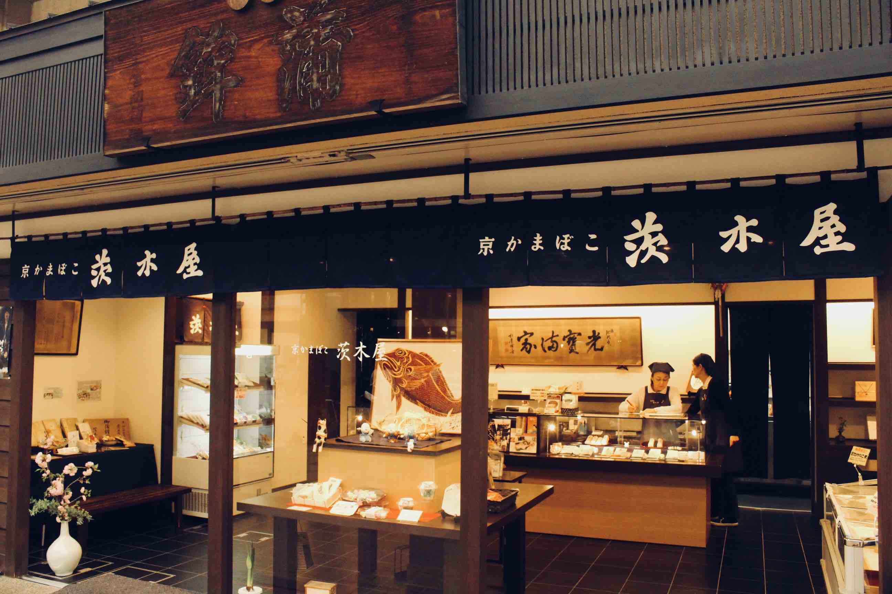
*锦市场*

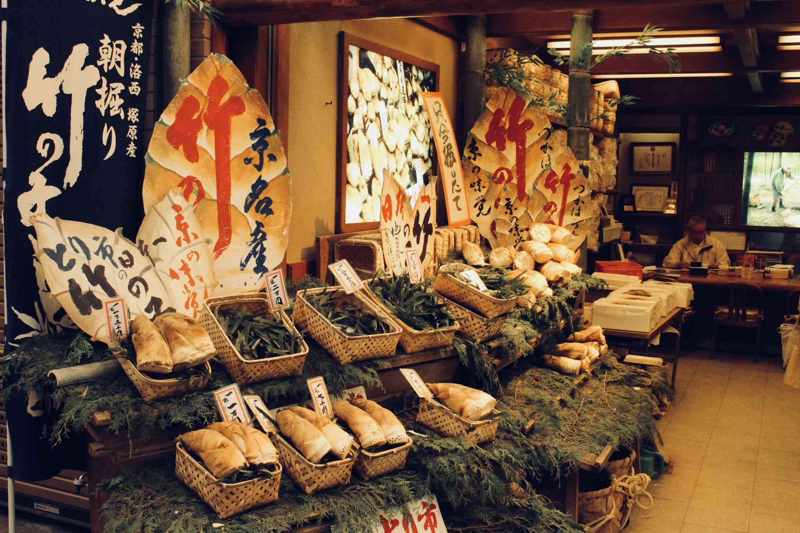
*锦市场*

*锦市场* ***Lupicia****专卖店*

-----

- 鸭川 Kamogawa River 

从锦市场出来沿着鸭川步行到八坂神社，这个时间大多数樱花都已经落得差不多了，不过鸭川一岸还有不少正在开的樱花树。如果是两个人，可以租两辆自行车沿着鸭川骑行。这个时间鸭川的水位很低，其实没什么好看的，不过到了你就会明白为什么鸭川叫鸭川了。

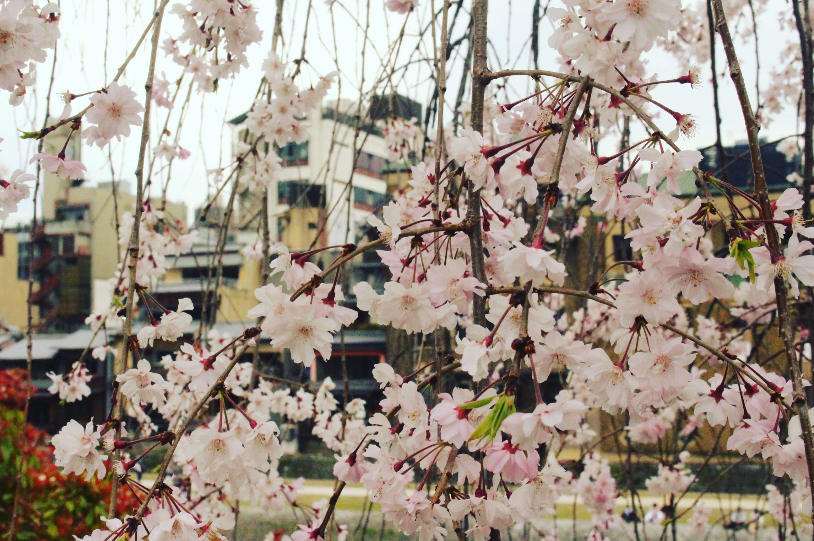
*樱花和对岸的先斗町*

- 八坂神社 Yasaka Shrine   

	> - 香火鼎盛，深受商人喜爱。气势非凡的八坂神社是关西地区最知名且历史最悠久的神社之一，京都人昵称它为“衹园桑”。神社大殿被称为“衹园造”，是日本独特的神社建筑，而舞殿上无数的提灯，让夜晚很是美丽。这里春天的樱花，秋天的红叶更是美不胜收。
	
八坂神社转得比较匆忙，我对八坂神社的印象似乎只有，**路边好吃的摊位很多！**不过值得一提的是八坂神社正门对面，一家名为**京の米料亭**的店，第一次路过很好奇为什么会有那么多人排队，开始还以为是在等公交，后来才意识到，原来这就是早上画画时小姐姐大力安利的那家米饭巨好吃的店。这家店需要在每天上午10点到10点半预约，在11点之后排队才能进店。

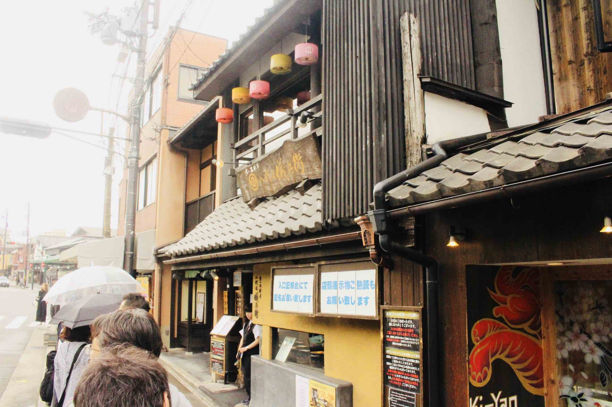
*已经预约却还要排队的米料亭*
	
- **住处地址: 11-1 Ishidachō Higashikujō, 南区, 京都府 601-8032, 日本**

#### *Apr 6* - Day 3 京都Kyoto

----

上午收拾好行李，check-out只需要将钥匙放在床头的钥匙盒里即可。出来的时候刚好遇到一个白人小哥一样提着行李出门，于是从住处走到地铁站的途中寒暄了几句，交流了一下都玩过了什么地方，接下来要去哪里玩。

日本铁道有一个非常好的地方，就是**每一个地铁站、电车站几乎都有一排寄存行李的柜子**，根据空间大小，费用从300到600日元每日不等。这给我的旅行带来了非常大的便利。

----

这天从中午开始下起雨，但所到之处游人并没有减少，只是从一个个人头变成了一把把雨伞。下雨天对于我这种随时会在路边掏钱买吃的的人来说算是非常不友好了，有种就算再给我两只手也不够用的感觉。

- 清水坂 Kiyomizuzaka  
清水寺 Kiyomizu-dera Temple <http://www.kiyomizudera.or.jp/>   
三年坂二年坂 Sannenzaka Ninenzaka

	- ***赏樱(rén), 2h***
	
	> - 全名音羽山清水寺，著名的赏枫及赏樱景点，与金阁寺、二条城并列为京都三大名胜，1994年被列入世界文化遗产名录。
	- 最大的看点是悬空的清水舞台，站在这里不仅可以眺望京都的街道，本堂内供奉的十一面千手观音像还是能够保佑财运的文化遗产。
	- 内有音羽瀑布，清泉一分为三，分别代表了“学业成就”、“恋爱成就”、“长寿祈愿”三个层面，从这三个泉口任选一个然后饮下此泉水，许下的愿望就实现。但是需要注意的是，如果欲望太多饮下太多泉水，反而会适得其反。

从二年坂三年坂登上清水寺。**二年三年坂是若干个通往清水寺的小巷子其中的两条**。巷子不宽，而两侧是一家一家的店铺，给人一种异常热闹的感觉。而清水寺的建筑自成风格，色调以鲜红为主，如果赶上樱花全盛开时，应该是另一幅美景了。

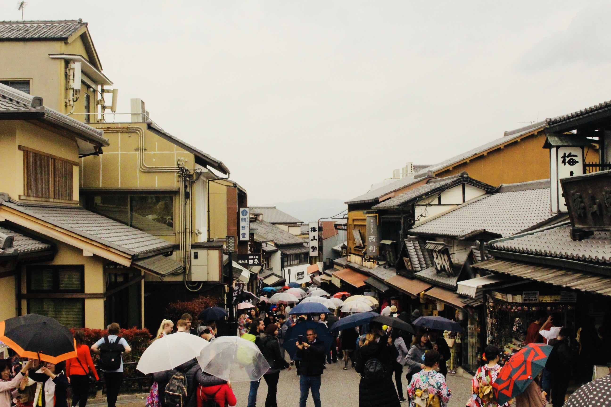
*三年坂*

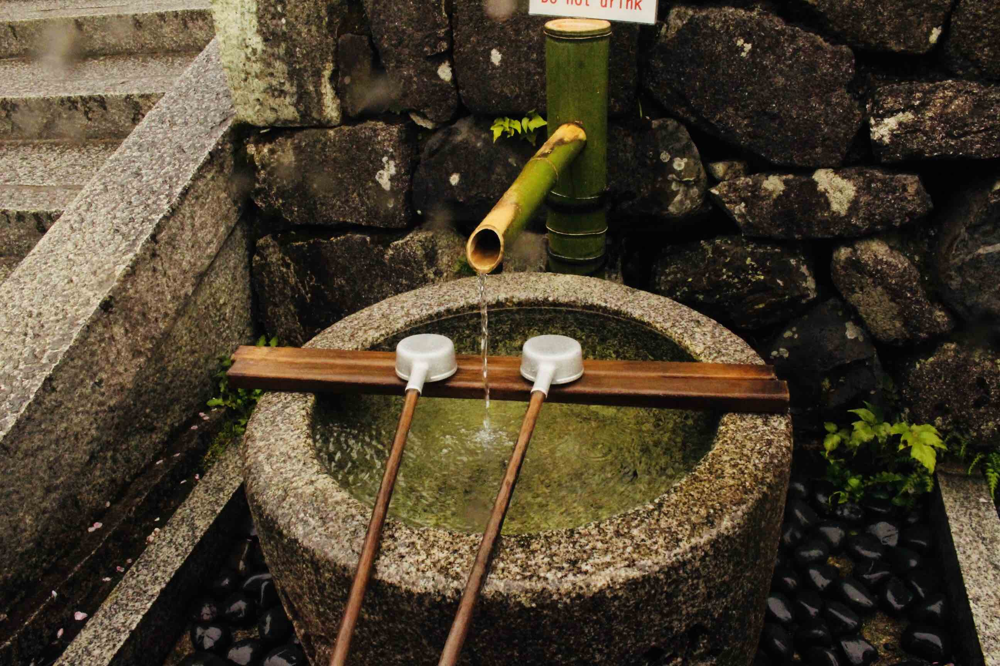
*清水寺*

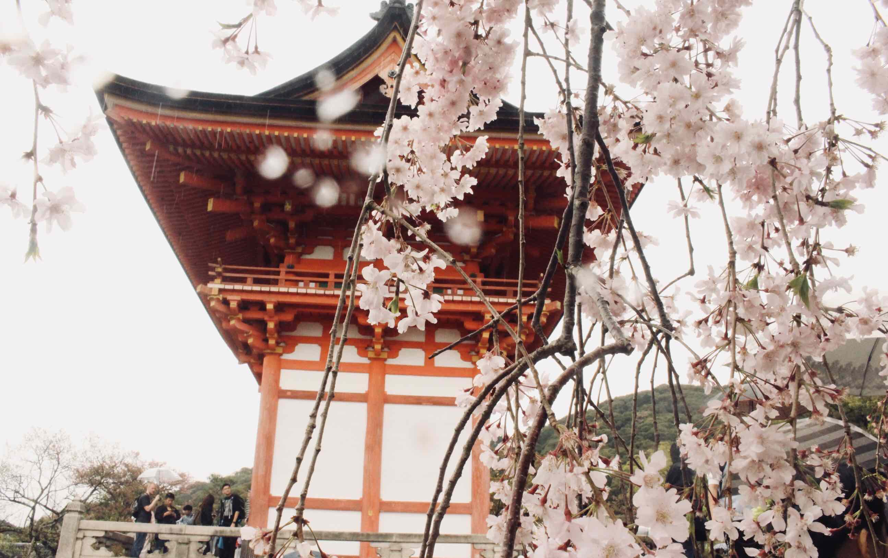
*清水寺*

由于前一天在伏见稻荷大社是以彩绘为主，走的都是人流较少的路线，玩得很匆忙，也并没有爬上山。因此在赶往大阪前，顺路又来了一次伏见稻荷大社。这一次好好地体验了一下从稻荷站到神社之间的美食，也比前一天爬到了稻荷山更高的地方。**葱和鸡肉的串烧、鲷鱼烧**...印象最深的是**鸟皮饺子**，之前从未听闻过这种做法，第一次吃被惊艳到了，饺子皮用的是完整的鸡皮，咀嚼起来弹性十足、鸡皮油脂的香味四溢。

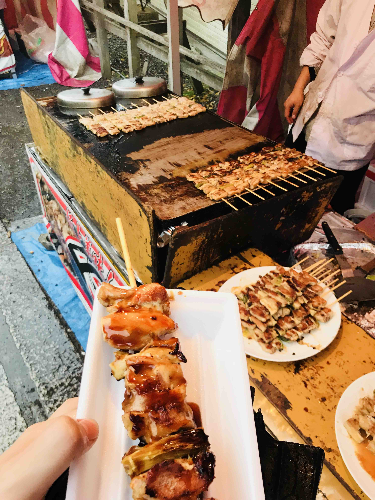
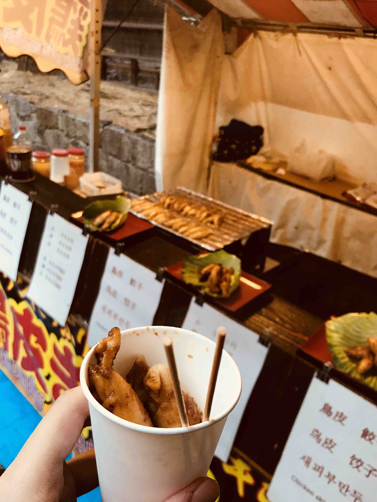

----

晚上将近6点，回到稻荷站乘坐电车赶往大阪（原计划是直接做JR到大阪，不过行李寄存在了电车站内）。因为刚好是下班放学的时间，电车上人很多，人们也都十分疲惫，环视四周大概有一半的人都在闭着眼休息。很多在大城市上学，但家在周边小城镇的学生，每天需要坐电车上下学，好在日本铁路系统比较发达，不禁感慨日本的学生也不容易啊。

- **交通: 电车京阪本线, 耗时40分钟到达天王寺站。转地铁御堂筋线到大国町站**

- **晚上的文字烧**

来日本之后最欢乐的一顿饭，也是因为从这里开始人多了起来，这是我们一行8人汇合后的第一顿饭。晚上10点，我们在**道顿掘**找到了为数不多的这么晚还营业着的文字烧店。文字烧端上来的时候只是配好的一碗原料，需要每个人自己动手在铁板上把食材烧熟。经过各种手忙脚乱，烧好的食物带着糊味，文字烧绝对不是最好吃的一顿饭，但绝对是最欢乐、最有乐趣的一顿饭，对于之前并不是互相熟悉的我和各位大佬，成为了一个绝佳的破冰活动。

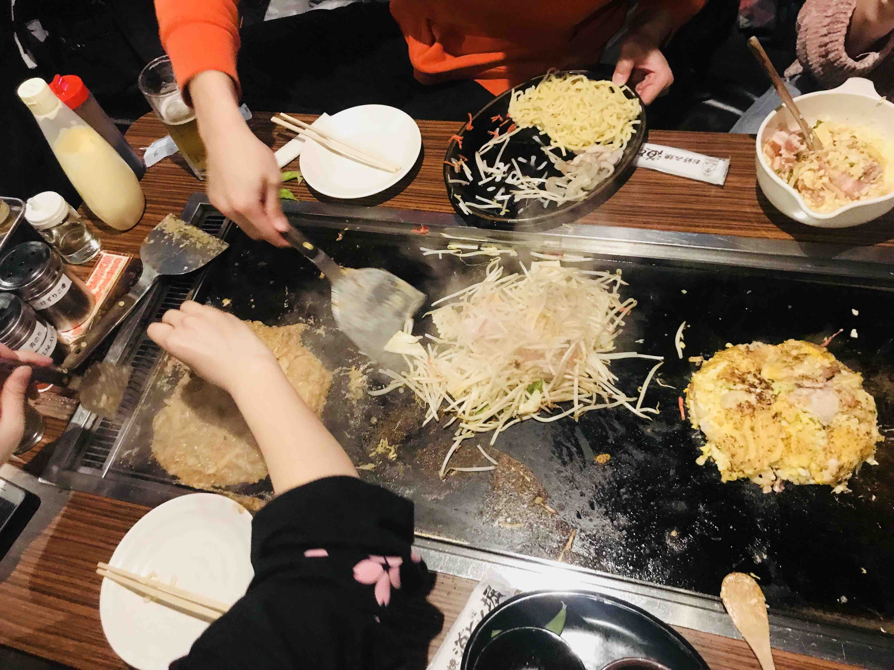

- **住处地址：大阪市浪速区敷津西2-1-5, 2 Chome-1-5 Shikitsunishi**, 这里需要表扬一下定住处的同学，虽然房子不大，但离地铁站真的近，从地铁出口出来大概步行2m doge.jpg，而且离中转枢纽难波和商业步行街道顿掘只有一站的距离。

#### *Apr 7* - Day 4 大阪Osaka 

----

- 方便面发明纪念馆 / 朝日啤酒 吹畑工厂：

原计划中要去的地方，但因为都需要提前至少一周预约所以没有去成，有点可惜。
	 
- 大阪公园、天守阁

天守阁是一个有着战国历史背景的建筑，在战国时期曾为丰臣秀吉的居所，所处即为原大阪城，算是大阪的起源之处以及地标之一。

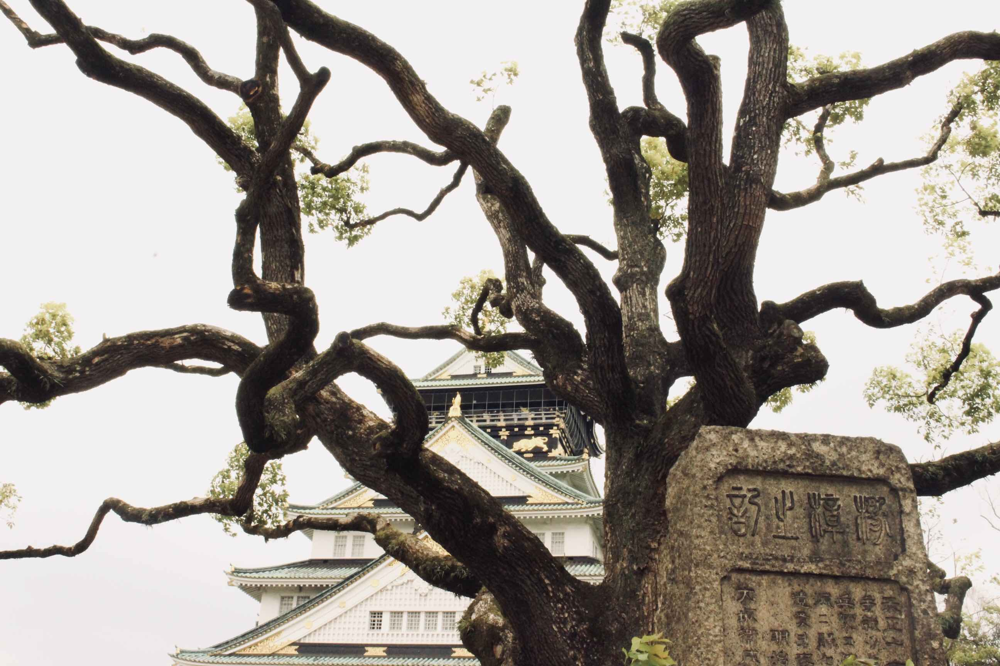
*天守阁*
  

*旁边纪念品商店 各种以假乱真的食玩*
 
 这一天的午饭依旧回到道顿掘，在同行的女生们的安利下来到了网红店**一兰拉面**。在点好拉面上的各种配料后，还可以根据个人偏好选择**口味轻重、辛辣程度、面的硬度、高汤的浓淡、叉烧的多少**等等，拉面味道自然是没得说，搭配的**溏心温泉蛋**真的好吃到爆。
 
 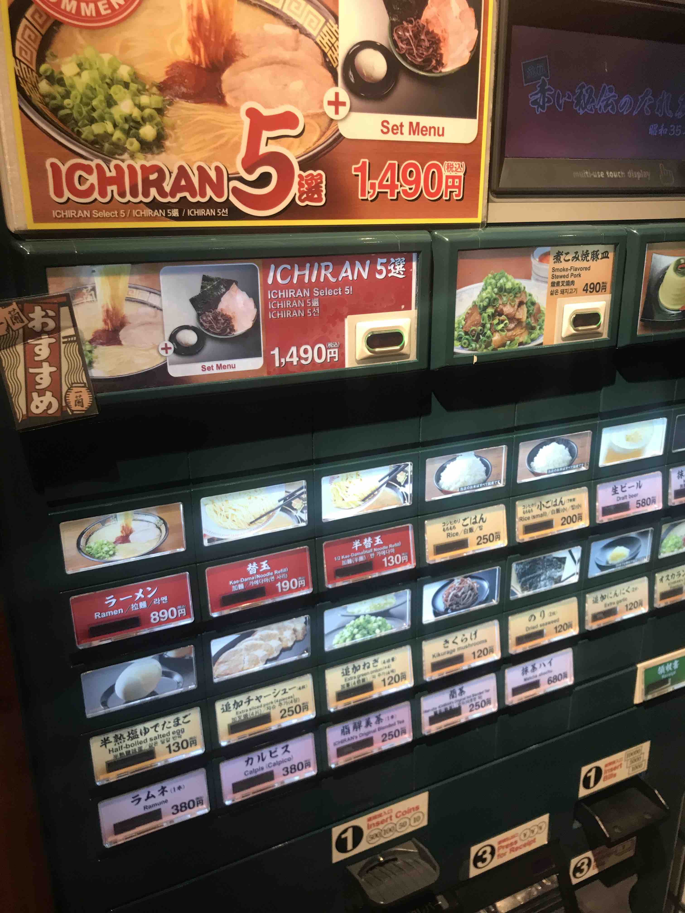
 *点面机*
 
 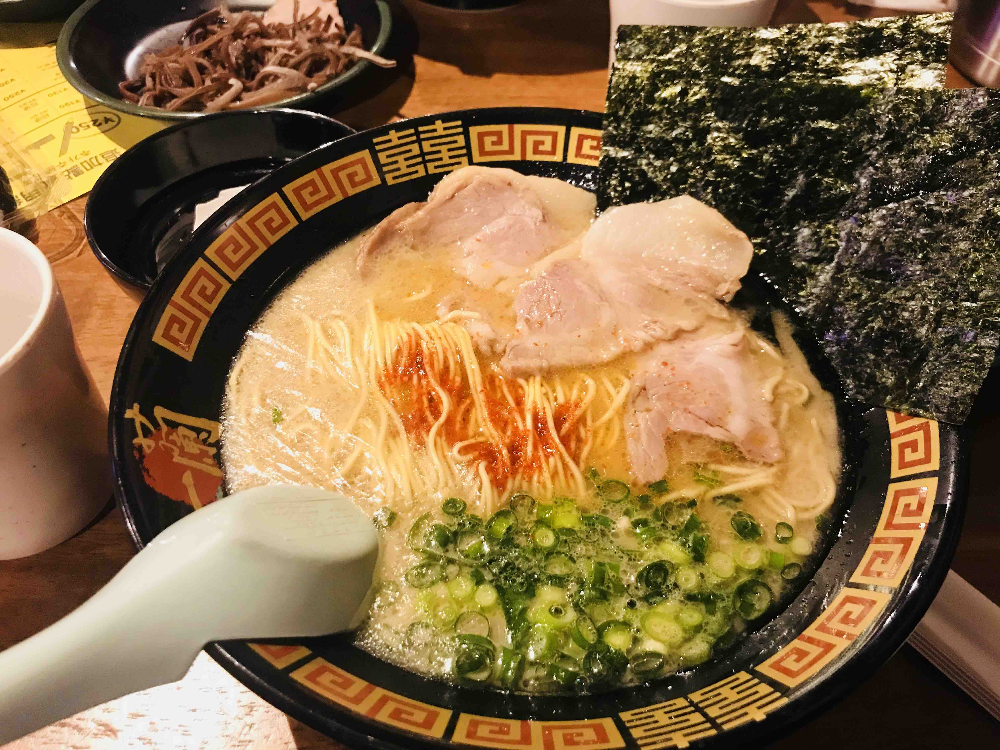

----

- 日本桥动漫街

日本桥离道顿掘只有一站的距离，**这里开始一行变为9个人**。我们先后逛了两大动漫商城**Kids Land**以及**Animate**。Kids Land看起来还是比较全年龄向的，以卖高达模型、各种手办为主；Animate的一二层出售各种齐全的漫画书、手办、抱枕、钥匙链等等全年龄向的商品；但从三楼开始，Animate真的刷新了我的世界观，宅男腐女**想看又怕被人看到的东西在这两层都可以买到**。而顶层五楼是一个专门提供给集换式卡片（主要是游戏王）爱好者的对战区域。虽然日本桥被成为大阪的秋叶原，但这里的动漫街和秋叶原还是没得比的。

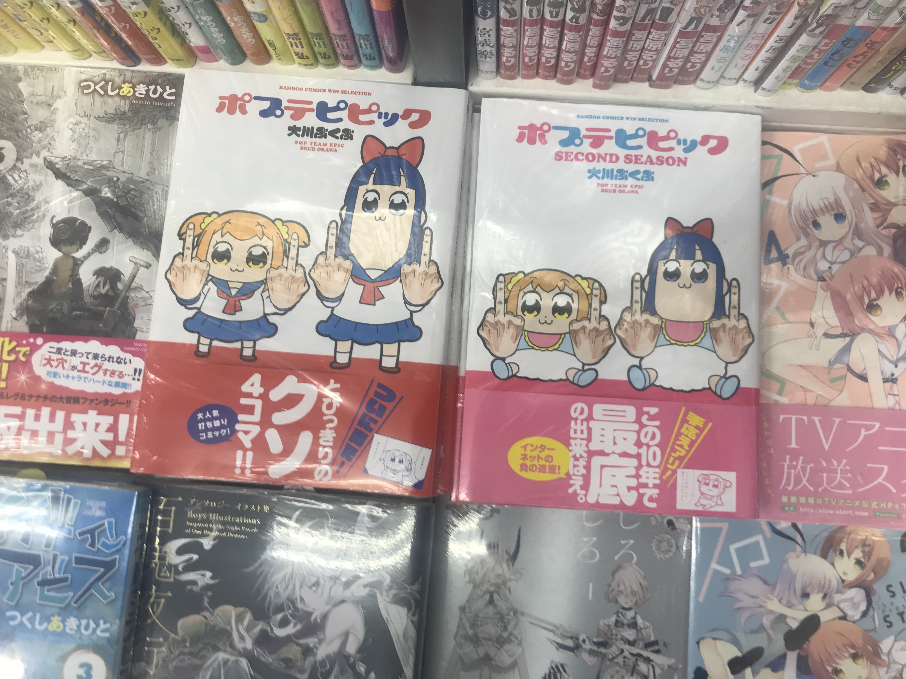
*一月霸权Pop子与Pipi美*
 
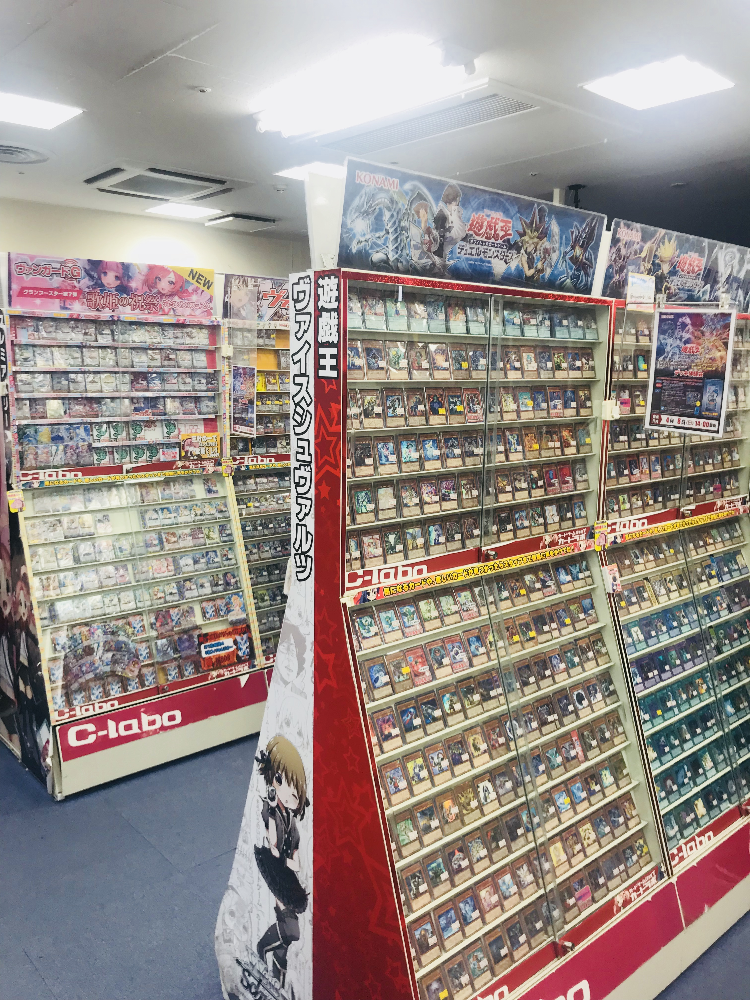
*Animate五层卡牌柜*
 
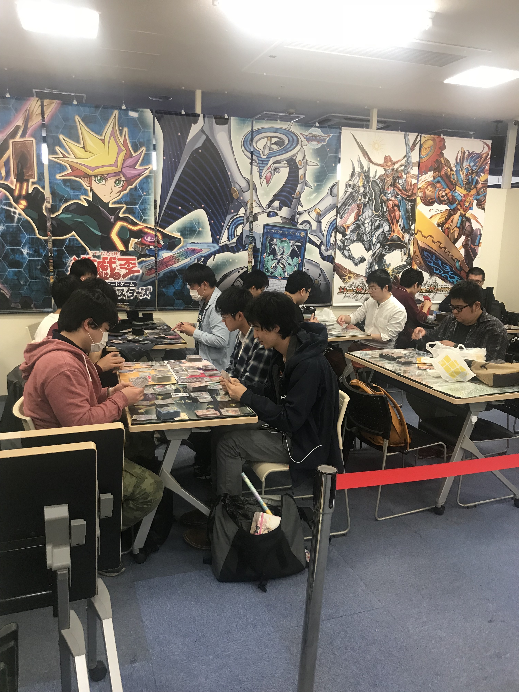
*专门用来卡牌对战的区域*
 
- 黑门市场 

黑门市场也在日本桥。我们的原计划是在黑门市场买新鲜的海鲜、牛肉食材回到住处自己料理。然而....走在菜市场的路上，经不住街边小摊的诱惑开始边走边买边吃，**和牛串、烤生蚝、烤年糕**...后来干脆跑到一家店里去吃了，以一个还算便宜的价格吃到了**金枪鱼大腹刺身**。不得不说，海鲜超市里买的各类鱼真的是便！宜！

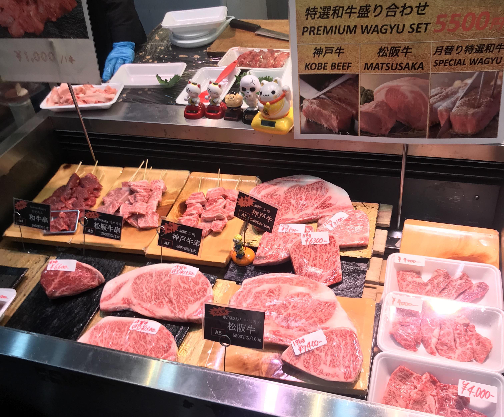
*纹路非常漂亮的牛肉*
 
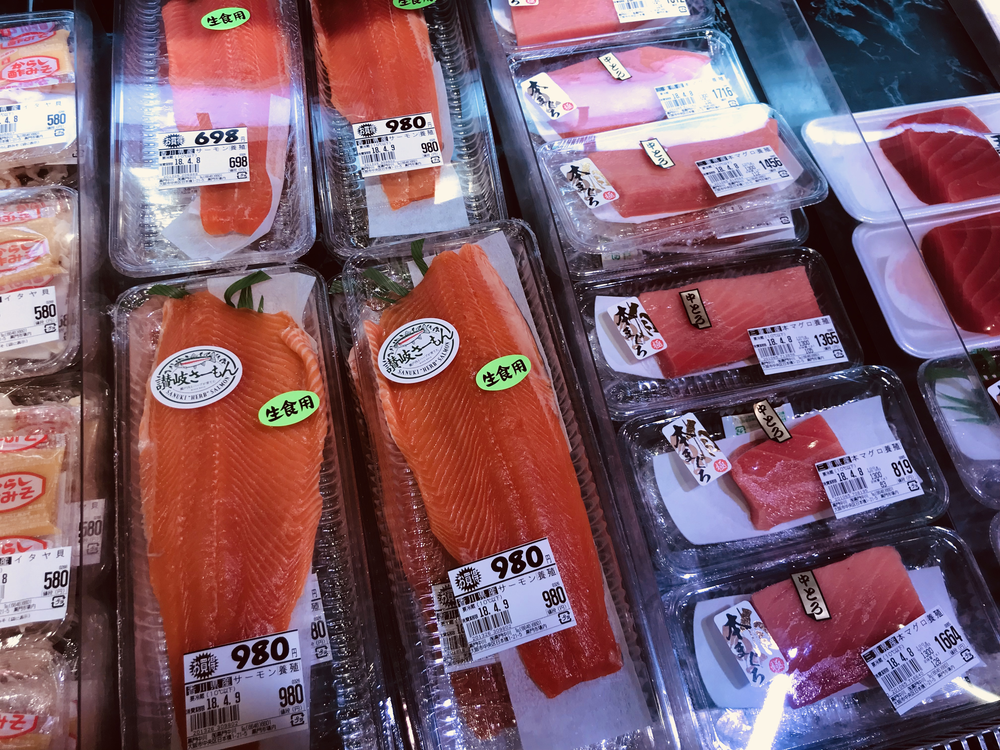
*各种白菜价的鱼类*
 
- 大阪蓝天大厦

晚上在这里俯瞰夜幕下的大阪，顶层平台上真的冷的一比。最遗憾的一件事就是，到了最需要用相机的时候，它没电了。

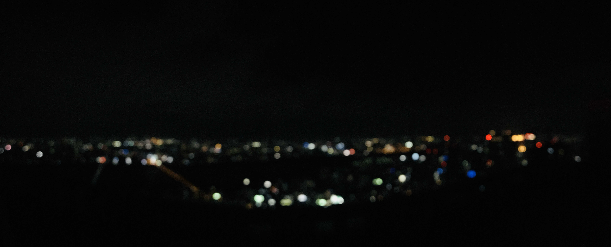
*大阪夜景*
 
晚上回到住处，我们拿起Switch，开始欢乐的四人分手厨房。

----

- 在民宿做晚饭。(**已经饱了，咕咕咕**)

- **住在大阪。**

#### *Apr 8* - Day 5 大阪Osaka 神户Kobe

----

- 中之岛渔港/食堂

这里游客很少，起初还怀疑自己是不是走错地方了。在中之岛可以吃到各种**当日打捞上来的活鱼、虾以及贝类，可以炭烤，也可以现切做成刺身**。在这里最大的好处就是，所有的海鲜食材都非常新鲜，就连只要300日元的鱼头汤味道都非常鲜美，当然最爽的还是整条鱼的炭烤或刺身，刺身保留了鱼肉最原始最真实的口感和味道，活鱼现切更是原汁原味了。

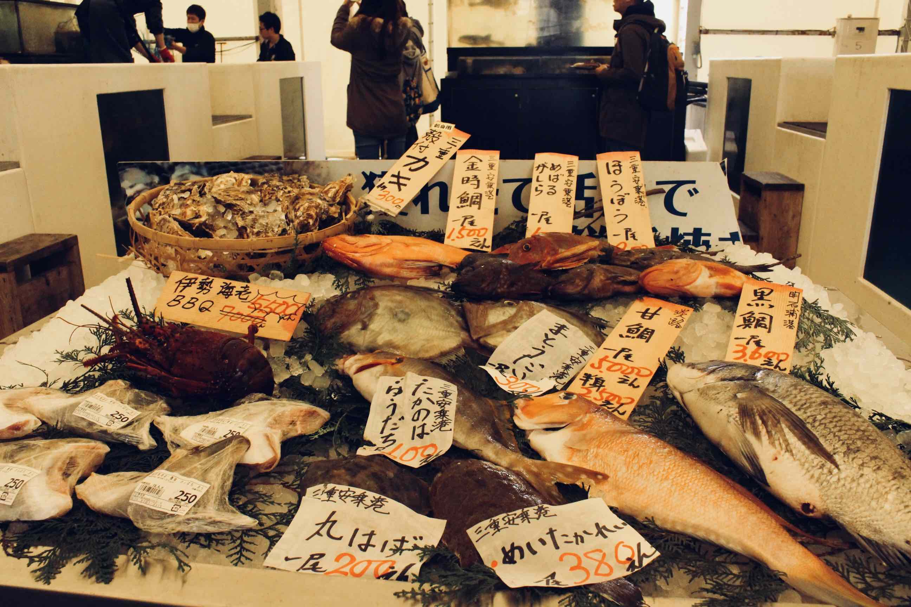
*宰好的各种鱼、伊势龙虾*
 
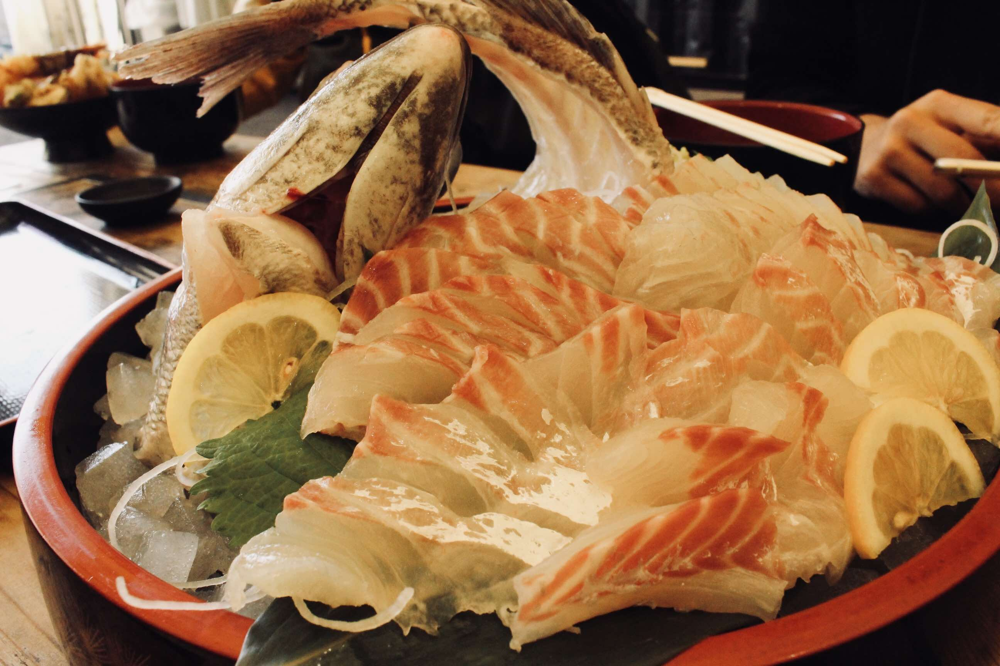
*活鱼现切的真鲷刺身*

- 大阪海游馆 Osaka Aquarium KAIYUKAN <http://www.kaiyukan.com/>

本以为海游馆人会爆满，到了却发现售票处买票几乎都没怎么排队，不过进到海游馆里面才发现，人还是不少的。到海游馆里面，沿途耳边全是斯过一 (すごい)、斯过 (すご)，海狮跳出水面——“斯过！”，一条大鱼游过来——“斯过！”。

*各种奇异的深海生物*
 

*第一次见这么多种水母*
 
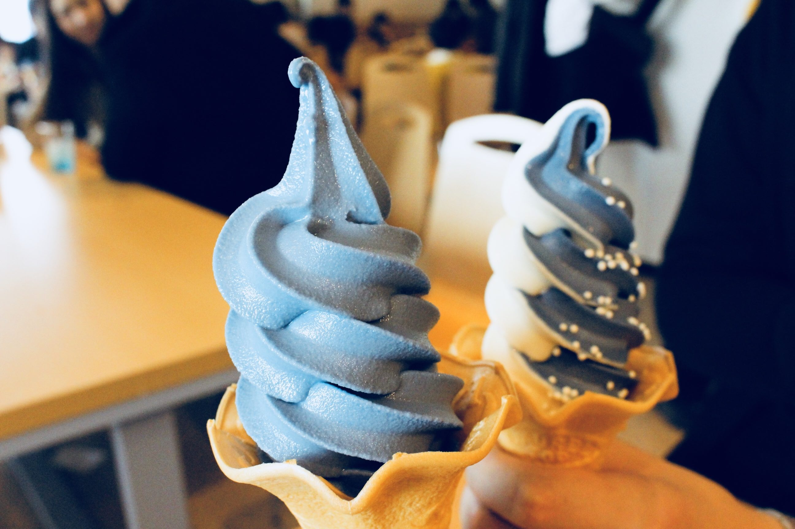
*两只单身狗。岂可修！*

**离开海游馆，即将迎来本次旅行的高潮**。接下来是整个行程中人均消费最高的一个晚上（高达1400RMB）。

----
- **交通: 難波站，乘坐阪神なんば線快速急行到达神戸三宮, 在神户三宫乘坐地铁西神山手线、北神急行电铁直通到谷上站换乘神户电铁到有马口再换乘到有马温泉。大约耗时90分钟。**

- 有马温泉, 怀石晚餐, 日式早餐自助

在前往海游馆之前，我们把行李寄存在了难波站，此时轻装简从前往神户有马。在经过四次换乘之后，到达了有马温泉站（幸亏对复杂的铁路系统早有心理准备）。到达有马温泉站之后，已经有酒店的巴士在站门口等候了。

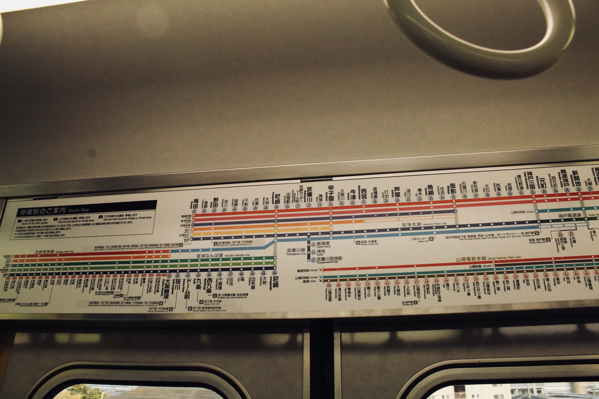
*眼花缭乱的电车线路*
 

这一晚的酒店是在Agoda上预定的**Arima Grand Hotel**，属于有马温泉区域环境、服务以及性价比综合起来最高的酒店，当然也需要提前很久预定才有空房。**全程从预定到入住当天，都是由专人与我进行邮件沟通**，确定 Check-in时间、人数，晚餐的特殊需求等等。

我们入住的房间是一个和式套间，说来有趣，有马温泉区域的很多酒店都是包含一顿晚餐和一顿早餐的（在日本称为**一泊二食**），而收费也是在房间的基础上按照人头收费的。Check-In的时候已经将近晚上7点了，到房间稍作休息，穿着和服的服务员敲门告诉我们，晚餐已经准备好了，为我们准备了Private Room，7:30可以到二楼某某房间用餐。

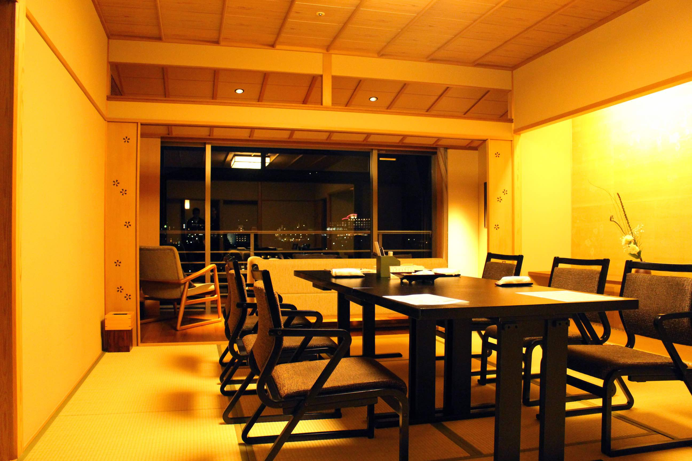
*入住的和式房*
 
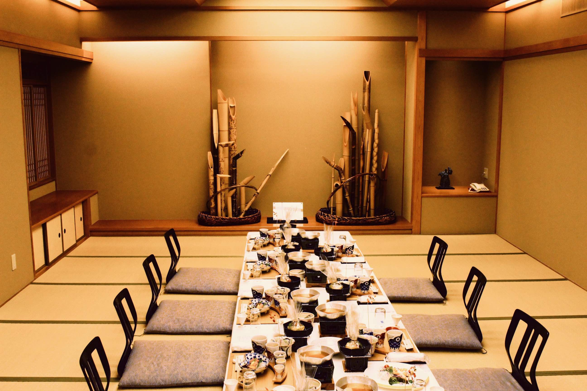
*怀石套餐*

我们吃怀石料理的整个过程就是：**虽然不知道这是啥，但是好好吃啊**，这样的感觉。怀石料理最早是由僧人发明的，口味相对比较清淡，食材很多取自山中的野菜。但好吃是真的好吃，各种从未见过的食材，以及各种没见过的料理方法，带来的是接连不断的新奇的体验。
 
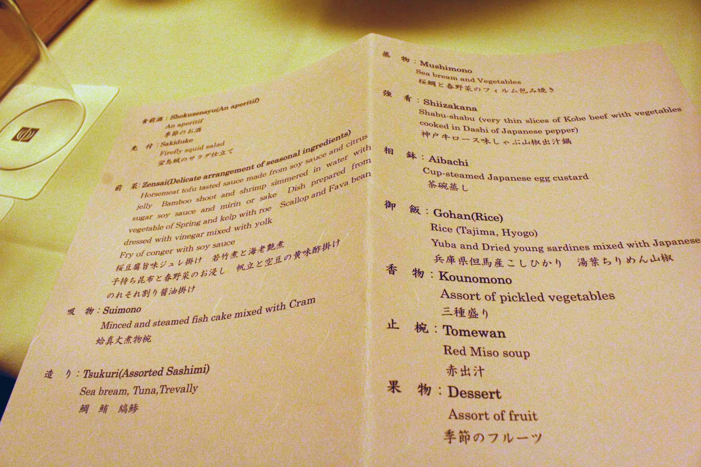
*Menu*
 

*餐前酒、先付、前菜、蒸物*

主菜（所谓的强香）是我们每人额外加了3000多日元从黑毛和牛换成的**神户牛肉 Shabu-Shabu**，神户牛肉光是从肥瘦纹理就从视觉上带来了极大的享受。在小锅中涮好，放进嘴里的瞬间，感觉香味充满了整个脑袋，香味浓厚但是完全不会腻。

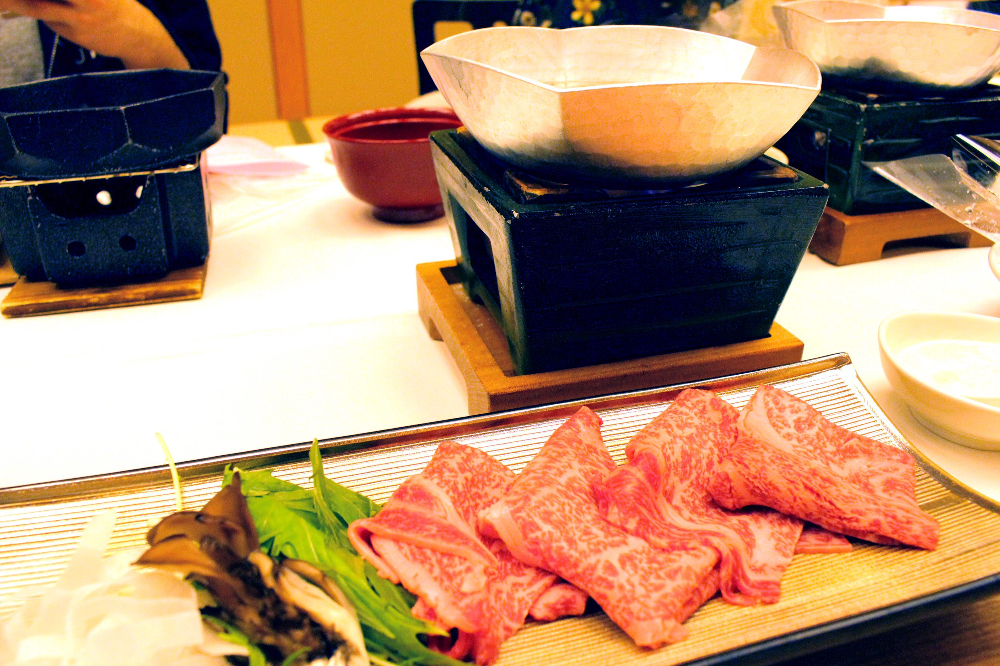
*神户牛肉！*

当我们吃完饭再次回到房间，发现已经有人帮我们换下了长桌，铺好了床铺。

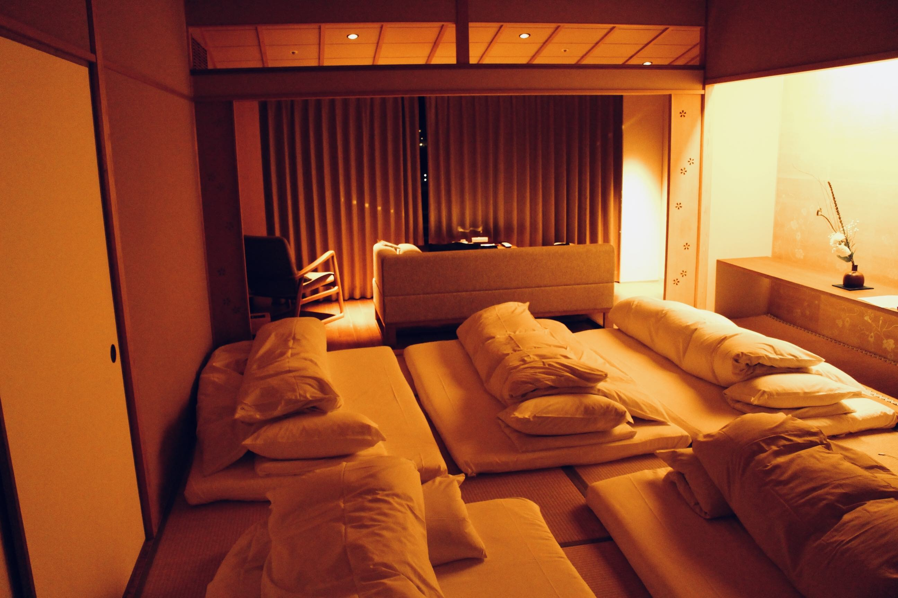
*铺好床铺的房间*

在屋中休息了一会，醒了醒酒，我们换上了酒店准备好的和式浴衣，前往九层的温泉。在进入露天温泉池之前，每个人需要坐在一个个隔间的小板凳上洗澡，把身子清洁干净，然后泡一泡室内的清水温泉，之后才能去泡露天的金汤银汤。

泡金汤的时候遇到了一位日本大叔，通行的一位会日语的大佬就开始和大叔谈笑风生。期间问道，如果不小心喝进去金汤会有毒吗？大叔数了数人头说，**有毒的应该是我们7个人才对**。

因为一直在聊天，泡汤时间稍微有点久了（大叔说**最好不要连续泡超过15分钟，休息一会再继续泡**），出来的时候每个人都有点面红耳赤。在同一层喝着免费的凉茶，悠闲地躺在按摩椅上，提前过起了老年人的生活。这一天回到房间后舒服地睡了一觉，前几天一直四处奔波的旅行带来的疲劳在这一晚被一扫而光。

- **住处地址: 〒651-1401 兵庫県神戸市北区有馬町1304-1，有馬グランドホテル, 078-903-5489**

#### *Apr 9* - Day 6 奈良Nara

----

酒店早饭的时间是7:30到9:30，为了吃到早饭特地早早的(八点多..)起床。早晨只能用丰盛二字来形容。来到日本之后，基本上要么是没有早餐，要么是到便利店买饭团吃，而这一次早餐我们吃到扶着墙出。和式的早餐已经足够丰富，另一半西式早餐已经完全被我无视掉了，**温泉蛋、茶泡饭、各种饭团、味增汤、和牛肉、玉子烧、茶碗蒸、腌各种生鱼片、烤多春鱼**...每一种都被我吃了个遍。

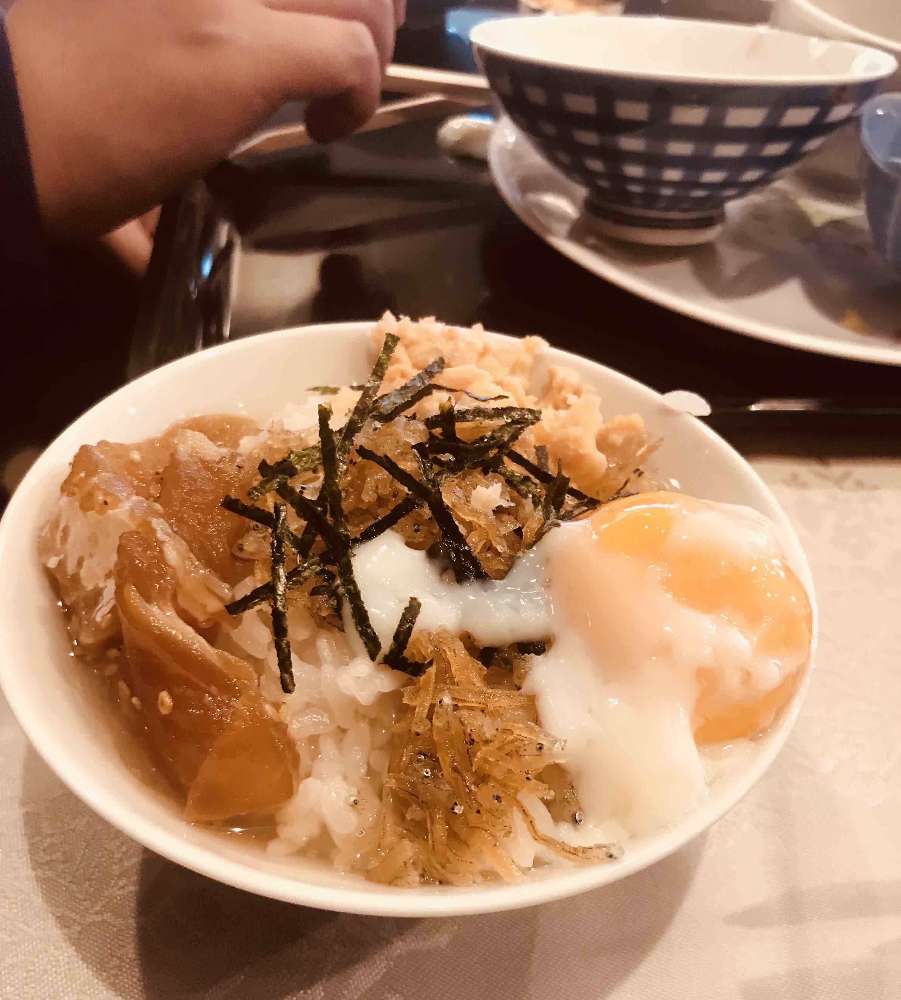
*茶泡饭 X 温泉蛋：自己盛饭、自己浇汤、自己加银鱼、腌鲑鱼、海苔*
 
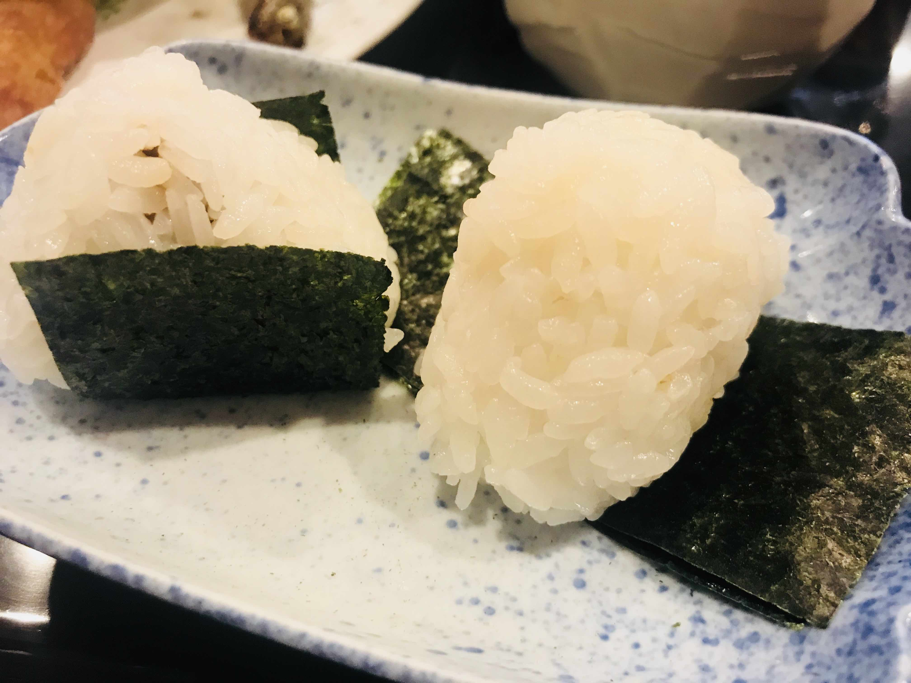
*两种口味的饭团*

----
 - **交通：乘电车到达神户三宫，930日元，换乘近铁直达近铁奈良，约1400日元**
 - 奈良公园 Nara Park <http://nara-park.com/>
 	- ***喂鹿！ ✧(≖ ◡ ≖✿)***
 	- *( 感受鹿的恐怖吧 )*

公园很大，道路边会有卖鹿饼的商贩，一旦你手里的鹿饼被某只鹿闻到或盯上，它就会一直跟着你。有的时候还会顶你或者咬你的裤子来吸引你的注意力。路上碰到一个大叔刚买了两包鹿饼，被一大群鹿围住，立马吓得把两包鹿饼全都扔到了地上。**所以不要以为鹿是非常可爱的生物啊，他们为了吃啥都干得出来！**

 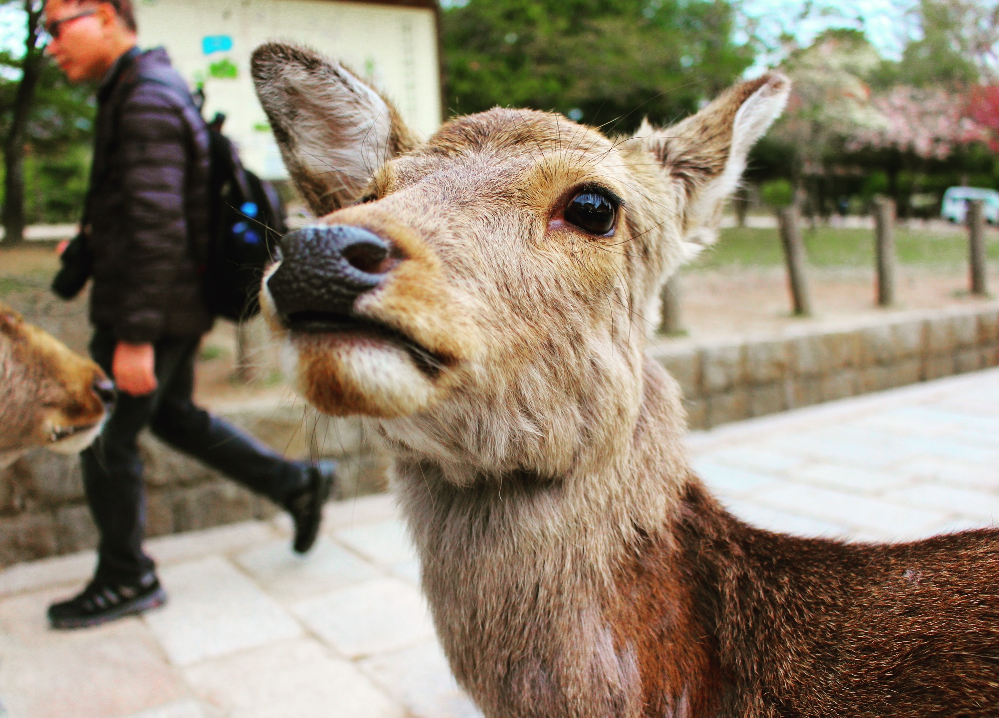
 
 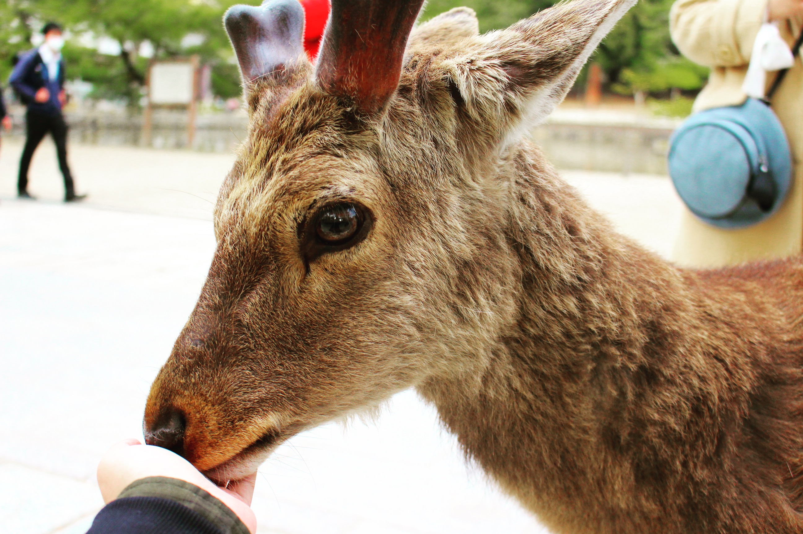

- **交通：奈良近铁原路返回大阪**

- 晚餐

新的住处在大阪靠东的今里，也属于游客稀少，很安静的区域。晚上从奈良回到住处提着行李，已经累得不行。女生们想去尝一尝蟹道乐，我实在懒了，于是几个人分头行动。一行二男三女跋涉到道顿掘，剩下四个男生到了住处对面一家寿司店。

因为这个区域几乎都是本地居民，这家店里的人中文不会、英文也只会一些简单的短语。尴尬的是，会说日语的大佬跟着女生去了道顿掘；更尴尬的是，这里没有菜单，来的客人都是根据放在橱窗里的当日食材来点刺身或寿司吃。点餐的时候，我们把想吃的东西用谷歌翻译翻译好，写在备忘录上给店家看，也是相当机智了。

 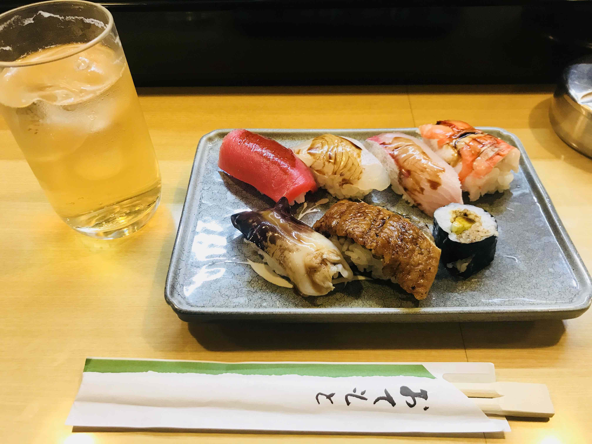
 *由于开始交流比较困难，直接给每个人上了一个寿司拼盘*

更神奇的是，吃的过程中，我们还和开店的一家人聊起天来，我们用英语混着蹩脚的日语，他们用日语混着蹩脚的英语。这家店是由老爷子老太太，与儿子儿媳一大家人一起开的，年轻一些的夫妇说他们的孩子之前在Osaka University读书，现在到了上海交流，正在学中文。

这对夫妇还蛮有趣的，我们点了几次单，妻子每次都说「Just a moment」，丈夫每次都无奈的纠正到「A moment please!」。然后转过头来问我用中文怎么说，我说「稍等」。然后接了一句「少々お待ちください」，然后他们一家子爆笑，说你的英语和日语都说的好好。那啥，游记写了好长啊...如果看到这里，微信私戳我「你好帅」，给你发个小红包好了。

 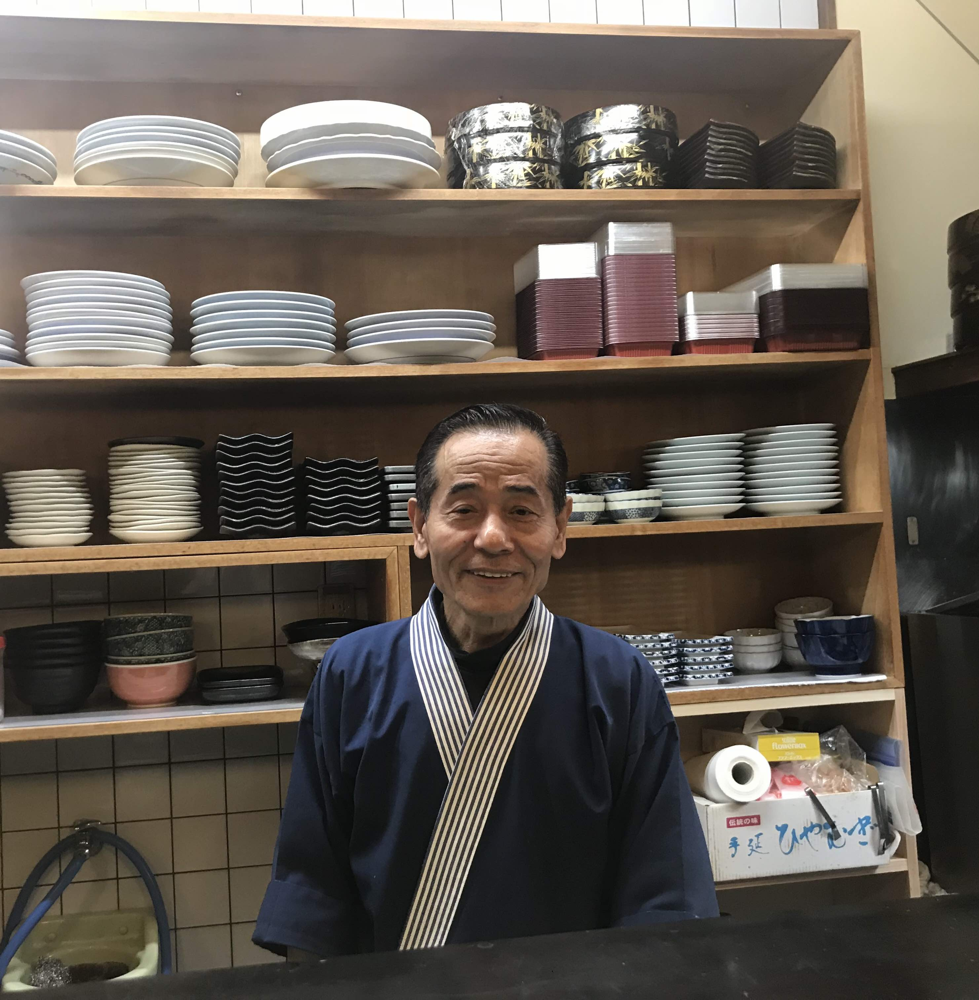
 *店里的老爷子*
 
 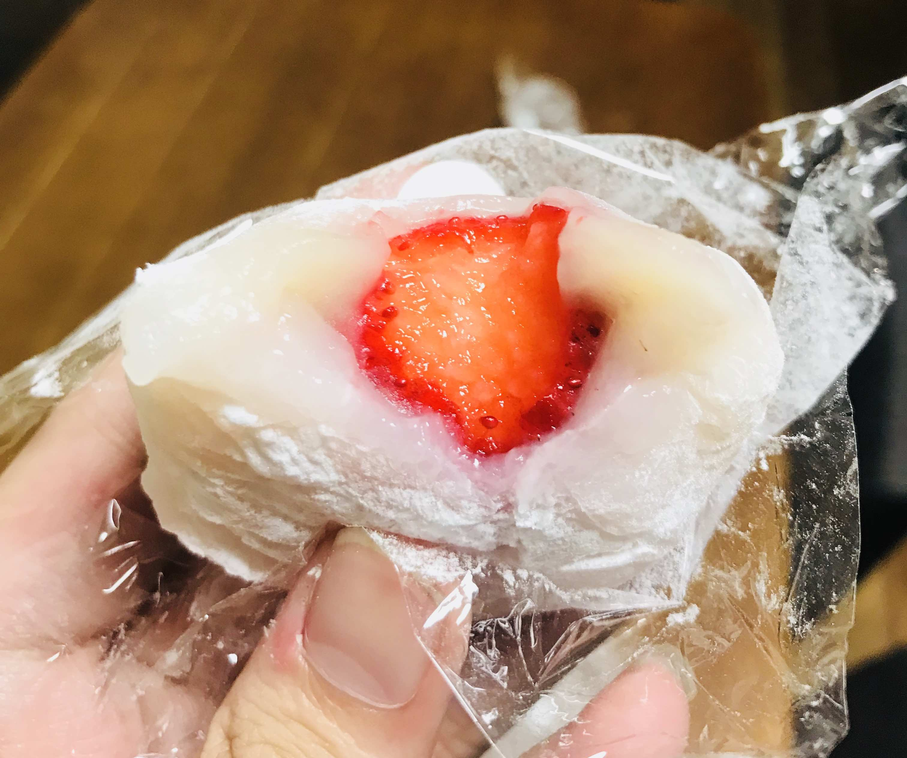
 *临走前还送给我们每人一个礼物，敲好吃*
 	
- **住在大阪**

#### *Apr 10* - Day 7 大阪Osaka 返程

----

早上六点起床到难波站坐南海急电到关西机场。时间还是有一点赶的。

- **交通：南海电车，40分钟。**

- **关西国际机场9:00am 登机。**
